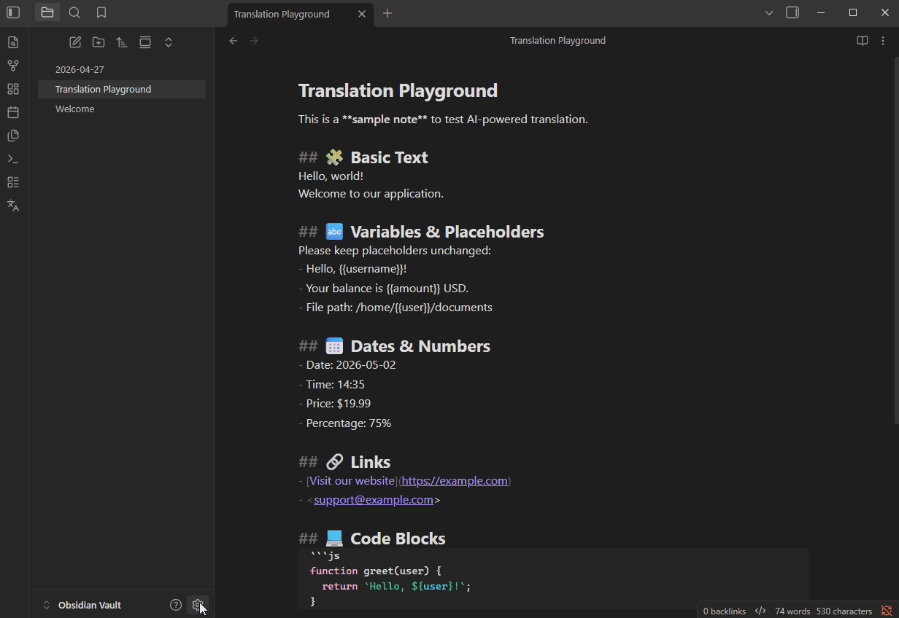

# L10n.dev - AI Translator for Obsidian

Translate your Obsidian notes using [l10n](https://l10n.dev).dev — an AI-powered localization API. Works on desktop and mobile.

## Features

- Context-aware translations using advanced AI. Translate to 165+ languages. Generates and save AI glossaries for consistent terminology across translations.
- Preserves Markdown formatting and structure. Supports json, yaml, other plain-text formats.
- Translate the active note via the command palette, ribbon icon, or right-click context menu.
- Dynamic language search — type a language name to find it instantly (no hardcoded list)
- Remembers your last used language — one keypress to repeat the same translation.
- Three output modes: create a new note, replace the current note, or append the translation.
- Optional YAML frontmatter preservation — translate only the note body if desired.
- Shows characters used and remaining balance after each translation.
- Mobile-compatible — uses Obsidian's native network layer, no Node.js APIs

## Requirements

A free [l10n.dev](https://l10n.dev) account. You receive **10,000 characters free per month** after signing up. Get your API key at [l10n.dev/ws/keys](https://l10n.dev/ws/keys).

## Installation

1. Open **Settings → Community plugins** and select **Browse**.
2. Search for **L10n.dev - AI Translator** ot **note ai translator**.
3. Select **Install**, then **Enable**.

## Setup

1. Open **Settings → L10n.dev - AI Translator**.
2. Paste your l10n.dev API key into the **API key** field.
3. Choose your preferred **Output behavior** and toggle **Translate frontmatter** as needed.

## Usage

With a note open, trigger translation in any of these ways:

- **Command palette** — run `Translate current note`
- **Ribbon** — select the globe icon in the left sidebar
- **Context menu** — right-click a file in the file explorer or inside the editor and select **Translate…**

A language picker will open. Type a language name (e.g. "Spanish", "German", "Japanese") and select your target language. The translation will be saved according to your output behavior setting.

### Repeat translation to the same language

After your first translation, the last used language is saved automatically. The next time the language picker opens, it pre-selects that language — press Enter to confirm without typing anything.

For even faster repeat translations, use the **Translate to last used language** command from the command palette. It skips the language picker entirely and translates immediately. Assign a hotkey to it in **Settings → Hotkeys** for one-keystroke translation.

## Output behavior

| Setting | Result |
|---|---|
| Create a new note (default) | Saves translation as `{filename} ({lang-code}).md` in the same folder |
| Replace current note content | Overwrites the current note with the translation |
| Append to current note | Appends the translation below a horizontal rule |

## Translation Glossary

A translation glossary maps specific source-language terms to approved target-language equivalents, ensuring the AI uses your exact terminology instead of valid-but-unintended synonyms. Glossaries are especially valuable for brand names, legal terms, clinical vocabulary, and product-specific concepts.

### AI Glossary Generation

When **Generate & save glossary** is enabled (config) it automatically builds a glossary from the source and translated target content, then save it as the active glossary for this source/target language pair. Once saved, the glossary is applied automatically on all future translations for the same language pair.

> **Note:** Glossary terms consume characters from your balance during translation. The character cost per translation is the combined length of all source terms, target terms, and context hints.

Manage your saved glossaries at [l10n.dev/ws/translation-glossary](https://l10n.dev/ws/translation-glossary).

## Linguistic Instructions

Linguistic Instructions let you guide AI:
  📝 "Use formal tone"
  📝 "Do not translate product names"
  📝 "Use active voice"

Unlike glossaries that control specific terms, Linguistic Instructions control the overall style, tone, and translation behavior.
Combined with AI Glossaries, they give much more control over localization quality and brand consistency.

Manage your saved linguistic Instructions at [l10n.dev/ws/linguistic-instructions](https://l10n.dev/ws/linguistic-instructions).

## AI Localization Agent

Turn your coding agent into a localization specialist. Add our MCP server to GitHub Copilot, Cursor, Claude, Codex, or Windsurf and let your agent translate i18n files without dumping unnecessary data to its context. See [AI Localization Agent Setup Guide](https://l10n.dev/help/ai-localization-agent)

## Localization

The plugin interface is translated into the following languages:

| Code | Language |
|------|----------|
| `en` | English (default) |
| `de` | German |
| `es` | Spanish |
| `fr` | French |
| `id` | Indonesian |
| `it` | Italian |
| `ja` | Japanese |
| `ko` | Korean |
| `pt` | Portuguese (Brazil) |
| `zh-CN` | Chinese (Simplified) |
| `zh-TW` | Chinese (Traditional) |

## Privacy

Translation requests are sent to the [AI translation API](https://api.l10n.dev/doc/#l10n-api-latest/tag/ai-translation) over HTTPS. l10n.dev does not store your content after translation. See the [l10n.dev terms of service](https://l10n.dev/terms-of-service) for details.

No telemetry or analytics are collected by this plugin.

## License

[MIT](LICENSE)
